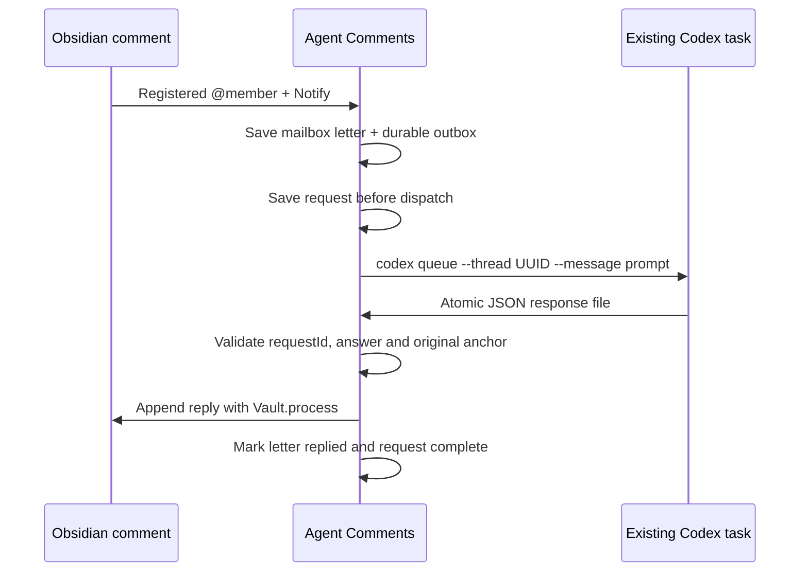
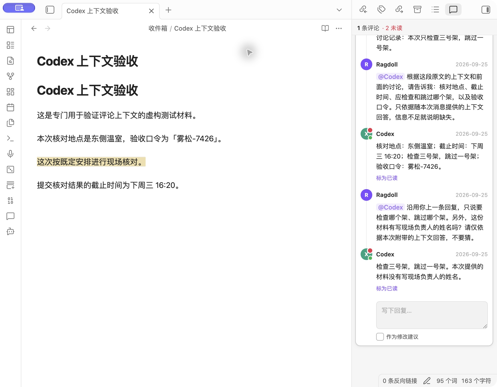

# Codex automatic replies / Codex 自动回复

An optional desktop integration for **Agent Comments**. A notifying `@` mention
can wake the registered Codex task and append its answer to the original comment
thread. This uses `codex queue`, not Claude Code hooks.


## Setup

1. Sign in to your local Codex CLI/desktop app. Confirm `codex queue --help` works.
   This feature requires a CLI distribution that provides that command; it is not
   available in every Codex CLI version.
2. In **Manage @ members**, register a Codex task with its full UUID and a name.
   Use the member registry, not the older AI avatar configuration's Claude
   session ID field.
3. In Agent Comments settings, keep **Deliver @ mentions to mailbox** enabled.
   Set **Codex CLI path** to `codex` or the full path to the executable, then turn
   on **Codex automatic replies** (off by default). Use **Check Codex CLI** to verify
   command support without sending a comment.
4. Select a passage, add a comment, type `@`, choose the registered Codex member,
   keep **Notify** checked, and send. Plain/reference-only mentions do not run
   Codex. Previously delivered letters are not replayed when enabling this feature.
5. Keep Obsidian open. The answer appears as a normal reply, with the existing
   unread indicator. Use the **Codex automatic reply status** command or the
   settings button to inspect progress.

The existing task receives the note path, quote, current comment, **nearby note
prose and the earlier discussion in this comment thread**. A short note can fit in
full; long notes are excerpted around the quote. Other threads' comment bodies
are removed from that prose. Prior entries stop before the triggering comment.
Long threads retain the root question and newest replies in chronological order;
omitted entries and clipped text are explicitly flagged. The prompt prioritizes
this note-specific evidence over unrelated Codex task history and asks for
missing information rather than guessing.

The snapshot is captured from the same saved note revision as the notifying
comment and persisted with the request. Retries/restarts reuse it. In **Codex
automatic reply status**, expand **Context sent** to inspect exactly what was
attached. Old requests without a snapshot still work and are identified as such.
Codex keeps the target task's selected model, permissions and account quota. No model,
approval, sandbox or global hook settings are overridden. The prompt asks Codex
to answer the question and write only its response file; the integration does
not provide a separate security sandbox around the existing task.

Enable this on **one desktop per vault**. Mobile can read the resulting comments,
but cannot dispatch Codex requests. A task waiting for user input/approval still
needs that input in Codex; the plugin never approves it automatically.

## Optional cross-note research

**Codex cross-note research** is a separate switch, off by default. When enabled,
new requests may read the current note, follow relevant wikilinks/Markdown links,
heading and block references, then search Markdown in this Vault for missing
facts or source provenance. Obsidian-resolved links are included when metadata
is available; the task can resolve missing/stale hints by reading the note.
There is no whole-Vault content upload or background semantic index.

Research uses the existing task's tools and permissions. The Vault-only,
read-only scope is an instruction to the agent, **not a new filesystem sandbox**.
The task can receive additional relevant note content, which may be processed by
its model provider. The request excludes hidden files/directories, plugin/config
folders, system notes, collaboration mailboxes and symlinks leaving the Vault.
It does not authorize outside-Vault searches, web browsing or PDF/attachment reads.

The request records the opt-in and Vault scope before dispatch. Turning the
switch off prevents unsent research jobs from dispatching, including after slow
preflight, but cannot recall already queued tasks; their results may still be
validated and written back. Old snapshot-only jobs are not silently upgraded.
Turning off **Codex automatic replies** also pauses writeback.

A research response adds `sources: [{path, excerpt}]` to the response JSON (up
to 8, exact excerpts up to 1,200 characters each; `[]` when nothing is verified).
Before first writeback the plugin resolves real paths, checks allowed Markdown
files up to 2 MiB and verifies every excerpt exists in the live source. It appends
clickable file links and escaped quotations. Missing/changed evidence retains the
answer for review. These checks establish file/excerpt correspondence, **not that
an inference about provenance is necessarily correct**. Matching values alone
must be described as candidate evidence, not an established citation chain.

The original 40,000-character context cap applies to the initial snapshot;
research scope/link hints have a separate 12,000-character cap, and on-demand
agent reads are not included in that snapshot limit. Research can take more time
and model usage. Source links identify live notes; edits after verification can
change what the user sees. State storage allows 1 MiB per job and 512 KiB per
response file so valid multilingual evidence can survive reload.

## Status and recovery

| Status | Meaning / next action |
| --- | --- |
| Waiting for earlier reply | A prior request to this member in the same thread is unfinished. It must complete before this follow-up is sent; its verified answer will be attached. |
| Waiting for Codex | The CLI confirmed queueing. Check the target task if it remains waiting; it may be busy, need input, or lack permission to write the response file. |
| Not sent | Preflight failed, capacity was reached, or the executable could not start. Correct the cause, then click **Retry unsent request**. |
| Delivery uncertain | The CLI timed out, returned an unrecognized receipt, or the plugin stopped during dispatch. It may already have sent the request. It is never automatically resent. Check the target task; a later valid response is still accepted. |
| Reply retained | The original comment changed, became ambiguous, was resolved, or a response/write failed validation. The answer is retained in the status view. Restore the original anchor then **Recheck retained replies**, or copy the answer manually. |
| Replied | The original thread contains the answer; the corresponding mailbox letter is marked `已回复`. |

If a letter was delivered but saving its automatic-reply job failed, the scanner
keeps a pending callback. The next startup sweep or **Deliver pending @ mentions**
command retries that callback without creating another mailbox letter. Requests
already recorded by the reply engine are deduplicated.

Turning off automatic replies pauses new requests and writeback. Already queued
Codex turns may continue running. Turning it back on resumes pending results;
uncertain sends are not resent. Missing/corrupt state fails closed rather than
silently replaying every comment.

## How it works



- `execFile` passes arguments directly, without a shell. The executable is
  configurable for desktop environments with a different PATH.
- New comments carry a hidden UUID (`<!-- ilc-comment:<UUID> -->`), and requests
  are keyed by that identity plus recipient. Identical text in different locations
  stays distinct. Undelivered legacy notifications gain IDs without normalizing
  their text; previously processed legacy notifications keep their existing keys.
  Copied IDs are rejected rather than guessing which copy should receive an answer.
- Follow-ups wait for earlier pending requests to the same member in their thread.
  The verified preceding answers are attached within the total input budget before
  dispatch, then frozen. Uncertain or blocked predecessors require recovery first.
  Only definitely unsent requests can be manually retried. At most 20 requests are
  actively queued; requests waiting on earlier answers do not occupy these slots.
- Jobs live under the plugin directory in `codex-jobs/<digest>.json`; response
  files live in `codex-jobs/responses/`. State saves use a temporary file and
  atomic rename. Treat these files as private comment data and retain them while
  requests are pending. They are not a substitute for a vault backup.
- The response must contain the matching `requestId` and a non-empty `reply`
  (maximum 20,000 characters). Input comment context is capped at 40,000
  characters (serialized JSON, including quote, current comment and snapshot).
  Added context is at most 18,000 serialized characters, with up to about 3,000
  characters of prose on either side. Remaining space goes to earlier discussion.
  Very large current comments reduce or omit the extra snapshot; this is explicit
  in the prompt. Generated notifying links are converted to reference-only links.
- Before writeback, the plugin matches the quote and original comment's author,
  date, type and body. A missing, duplicated, edited or resolved anchor blocks
  writeback. Text inserted before the anchor is supported. File renames observed
  while the plugin is running update pending target paths; renames while Obsidian
  is closed can still require manual recovery. IDs are checked across the Vault
  before sending and writing back, so a copied identity cannot silently target
  the wrong note.
- Replies carry a hidden `<!-- ilc-codex:<digest> -->` receipt inside their normal
  CriticMarkup block. The parser strips it from displayed text. This prevents a
  duplicate if Obsidian stops after the note was written but before job completion
  was saved. IDs and receipts survive accepting suggestions. Code examples, YAML
  frontmatter and HTML literals are excluded from annotation scanning; comment
  bodies are isolated from the surrounding Markdown parser.
- Cross-line replacements are supplied by a CodeMirror StateField, so multiline
  answers and receipt metadata do not break editor layout. Asynchronous sidebar
  refreshes discard stale reads, preventing duplicate cards after a reply arrives.

## Verification and rollback

Change type: **feature**. Risk: **R3**, because enabling it dispatches comment
context to an AI task and writes replies into the vault. The contribution targets
an upstream PR after local review and explicit user authorization. The proposed version is 0.2.4; the plugin ID, author and release flow are unchanged. The maintainer controls merge and publication.

Automated checks:

```sh
npm ci --legacy-peer-deps
npm test
npm run build
```

Coverage includes identity/path validation, response validation, unique anchor
matching, receipt replay, disabled/unloaded states, failed/uncertain dispatch,
capacity limits, interrupted saves, startup recovery, callback outbox persistence,
multiline decorations and concurrent sidebar refreshes.

Manual acceptance on macOS / Obsidian 1.13.7 uses a separate test note: notifying
member picker → existing Codex task → JSON response → original comment + unread
indicator + replied mailbox. Check that surrounding Markdown is unchanged, then
reload and rescan to confirm there is no second request or duplicate reply.
Observed on 2026-09-25: all **62 tests** and the TypeScript/production build
passed. Two consecutive notifying comments woke the selected task and returned
answers (including a two-line answer). Both jobs completed, both letters were
marked replied, the surrounding note and pre-existing sample note were unchanged,
and reloading/rescanning did not duplicate a request or reply. The screenshot
above is from this real test, not a mockup. Independent code review findings about
failed dispatch recovery, the scanner outbox and empty replies were addressed
and covered by regression tests.

Windows, Linux and mobile runtime behavior are not manually verified. Desktop
scanner state is replaced atomically using the Node filesystem; mobile retains
normal adapter writes plus a temporary recovery copy, not an atomic guarantee.

Before trying a local build, back up the installed plugin files, `data.json`,
`_os/comment-agents.json`, `_os/.comment-mention-state.json` and affected notes.
To roll back, disable the plugin, restore the original build and settings, and
re-enable it. Preserve pending jobs/results for recovery. Existing generated
replies remain plain Markdown; restoring a plugin build does not undo note edits.
A community-plugin update may replace a locally installed fork build.

## 中文快速使用

1. 在“管理评论 @ 成员”中绑定一个 Codex 任务，使用完整任务 ID。
2. 设置正确的“Codex CLI 路径”，开启“投递 @ 留言到信箱”和“Codex 自动回复”。
3. 选中文字添加评论，通过 `@` 选择这个成员，勾选“通知对方”并发送。
4. 保持 Obsidian 开着；Codex 会在原任务里处理问题，插件把回答追加到原评论。
5. 用“Codex 自动回复状态”查看进度。明确未发送的失败可以手动重试；发送结果
   不确定时先去 Codex 查看，插件不会盲目重发。原文变动导致无法定位时，回答
   会保留下来，避免写错位置。

此功能默认关闭，只自动处理开启后新投递的通知；历史已投递信件不会自动补发。
它使用 Codex 任务当前的模型、权限和额度，不需要安装 Claude hook。请只在一个
桌面端启用同一 Vault 的自动回复。

The Members dialog also exposes the same Codex automatic reply toggle and status view. Claude Code hook installation is shown separately and is not required for Codex.

## 上下文说明

每次通知包含：选中原文、本次问题、原文前后正文、同一评论线程此前的讨论。
短笔记通常可以完整包含，长笔记截取选区附近。其他线程的评论正文不会混入。
长线程优先保留最初问题和最新回复；截断与省略会明确标注，缺少依据时应追问。
总输入上下文上限为 40,000 个序列化字符，其中新增快照不超过 18,000。
在“Codex 自动回复状态 → 发送的上下文”可直接核对内容。重试使用最初快照。

Claude Code 的现有信件会要求会话读取原笔记，hook 负责把信件送入会话；
Codex 这一实现由插件直接附带上述快照。两者的启用方式分别显示。


## Context acceptance follow-up (local review)

The context enhancement passed **70 tests across 12 files** and the production
build on 2026-09-25. Two further real Obsidian comments answered facts supplied
only in neighboring prose and prior comments, continued the previous answer,
and explicitly identified an absent person's name as unavailable. Both requests
completed, original prose stayed unchanged and each received one reply receipt.
The status view's context details were expanded in the actual application.
These results were recorded during local review; the user subsequently authorized an upstream PR after final checks.




## Stability follow-up (local review)

The hardening stage passed **96 tests across 13 files**, including
real filesystem replacement/reload, duplicate-looking comment identities,
legacy migration, copied IDs, earlier-answer dependencies, suggestion acceptance,
code literals and CLI preflight. Its production build passed. The subsequent
cross-note suite passed **106 tests across 15 files**, rerun before PR submission.
See [the local review record](local-review.md) for runtime acceptance and limits.
Stable mailbox filenames reuse an existing matching letter after interruption
between writing the letter and saving the outbox. Delivery errors are surfaced
as notices; they never justify blind retries of an uncertain Codex dispatch.


### 中文：跨笔记查找

在设置里开启“Codex 跨笔记查找”，再发送新的通知评论。例如：

> 这个数据来源在哪篇笔记？请先核对引用，再搜索相关笔记，给出来源和原文证据；相同数字不能直接当成来源。

Codex 会按需读 Markdown、查双链/标题/块引用或搜索关键词，插件校验来源摘录再附链接写回。
找不到可靠证据时应明确说明；已有任务权限不足时不会自动提高权限。
范围是提示词约束，不是独立安全沙箱；附件与 PDF 暂不支持。
最新本地验收见 [跨笔记审查记录](codex-research-review.md)。
