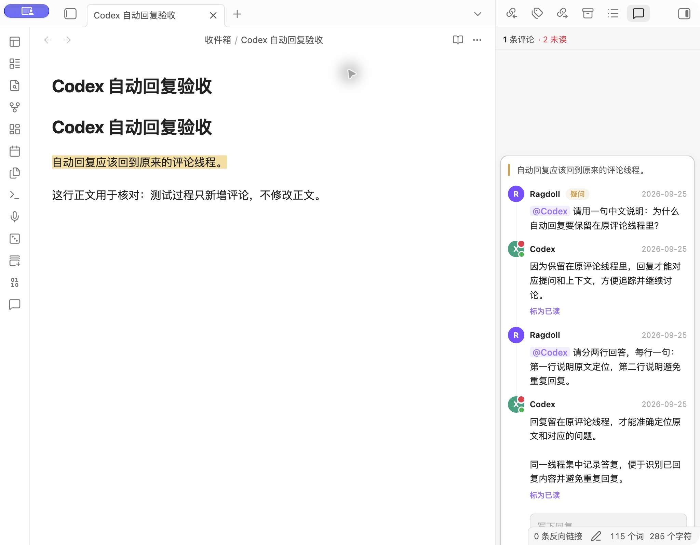
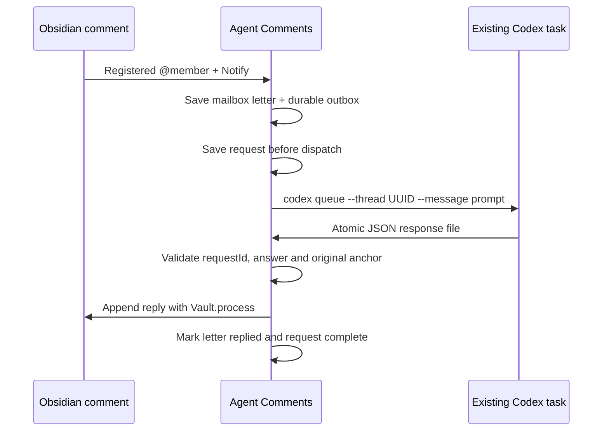

# Codex automatic replies / Codex 自动回复

An optional desktop integration for **Agent Comments**. A notifying `@` mention
can wake the registered Codex task and append its answer to the original comment
thread. This uses `codex queue`, not Claude Code hooks.



## Setup

1. Sign in to your local Codex CLI/desktop app. Confirm `codex queue --help` works.
   This feature requires a CLI distribution that provides that command; it is not
   available in every Codex CLI version.
2. In **Manage @ members**, register a Codex task with its full UUID and a name.
   Use the member registry, not the older AI avatar configuration's Claude
   session ID field.
3. In Agent Comments settings, keep **Deliver @ mentions to mailbox** enabled.
   Set **Codex CLI path** to `codex` or the full path to the executable, then turn
   on **Codex automatic replies** (off by default).
4. Select a passage, add a comment, type `@`, choose the registered Codex member,
   keep **Notify** checked, and send. Plain/reference-only mentions do not run
   Codex. Previously delivered letters are not replayed when enabling this feature.
5. Keep Obsidian open. The answer appears as a normal reply, with the existing
   unread indicator. Use the **Codex automatic reply status** command or the
   settings button to inspect progress.

The existing task receives the note path, quoted passage, author, and comment.
The plugin does not send the full note. Codex processes these with that task's
existing conversation, selected model, permissions and account quota. No model,
approval, sandbox or global hook settings are overridden. The prompt asks Codex
to answer the question and write only its response file; the integration does
not provide a separate security sandbox around the existing task.

Enable this on **one desktop per vault**. Mobile can read the resulting comments,
but cannot dispatch Codex requests. A task waiting for user input/approval still
needs that input in Codex; the plugin never approves it automatically.

## Status and recovery

| Status | Meaning / next action |
| --- | --- |
| Waiting for Codex | The CLI confirmed queueing. Check the target task if it remains waiting; it may be busy, need input, or lack permission to write the response file. |
| Not sent | Preflight failed, capacity was reached, or the executable could not start. Correct the cause, then click **Retry unsent request**. |
| Delivery uncertain | The CLI timed out, returned an unrecognized receipt, or the plugin stopped during dispatch. It may already have sent the request. It is never automatically resent. Check the target task; a later valid response is still accepted. |
| Reply retained | The original comment changed, became ambiguous, was resolved, or a response/write failed validation. The answer is retained in the status view. Restore the original anchor then **Recheck retained replies**, or copy the answer manually. |
| Replied | The original thread contains the answer; the corresponding mailbox letter is marked `已回复`. |

If a letter was delivered but saving its automatic-reply job failed, the scanner
keeps a pending callback. The next startup sweep or **Deliver pending @ mentions**
command retries that callback without creating another mailbox letter. Requests
already recorded by the reply engine are deduplicated.

Turning off automatic replies pauses new requests and writeback. Already queued
Codex turns may continue running. Turning it back on resumes pending results;
uncertain sends are not resent. Missing/corrupt state fails closed rather than
silently replaying every comment.

## How it works



- `execFile` passes arguments directly, without a shell. The executable is
  configurable for desktop environments with a different PATH.
- Requests are keyed by the existing mention digest. Only definitely unsent
  requests can be manually retried. At most 20 requests are pending at once.
- Jobs live under the plugin directory in `codex-jobs/<digest>.json`; response
  files live in `codex-jobs/responses/`. State saves use a temporary file and
  atomic rename. Treat these files as private comment data and retain them while
  requests are pending. They are not a substitute for a vault backup.
- The response must contain the matching `requestId` and a non-empty `reply`
  (maximum 20,000 characters). Input comment context is capped at 40,000
  characters. Generated notifying links are converted to reference-only links.
- Before writeback, the plugin matches the quote and original comment's author,
  date, type and body. A missing, duplicated, edited or resolved anchor blocks
  writeback. Text inserted before the anchor is supported; file renames while a
  request is pending require manual recovery.
- Replies carry a hidden `<!-- ilc-codex:<digest> -->` receipt inside their normal
  CriticMarkup block. The parser strips it from displayed text. This prevents a
  duplicate if Obsidian stops after the note was written but before job completion
  was saved. Ordinary comments keep their existing format.
- Cross-line replacements are supplied by a CodeMirror StateField, so multiline
  answers and receipt metadata do not break editor layout. Asynchronous sidebar
  refreshes discard stale reads, preventing duplicate cards after a reply arrives.

## Verification and rollback

Change type: **feature**. Risk: **R3**, because enabling it dispatches comment
context to an AI task and writes replies into the vault. The contribution targets
an upstream PR; it does not change the plugin ID, author, version or release flow.

Automated checks:

```sh
npm ci --legacy-peer-deps
npm test
npm run build
```

Coverage includes identity/path validation, response validation, unique anchor
matching, receipt replay, disabled/unloaded states, failed/uncertain dispatch,
capacity limits, interrupted saves, startup recovery, callback outbox persistence,
multiline decorations and concurrent sidebar refreshes.

Manual acceptance on macOS / Obsidian 1.13.7 uses a separate test note: notifying
member picker → existing Codex task → JSON response → original comment + unread
indicator + replied mailbox. Check that surrounding Markdown is unchanged, then
reload and rescan to confirm there is no second request or duplicate reply.
Observed on 2026-09-25: all **62 tests** and the TypeScript/production build
passed. Two consecutive notifying comments woke the selected task and returned
answers (including a two-line answer). Both jobs completed, both letters were
marked replied, the surrounding note and pre-existing sample note were unchanged,
and reloading/rescanning did not duplicate a request or reply. The screenshot
above is from this real test, not a mockup. Independent code review findings about
failed dispatch recovery, the scanner outbox and empty replies were addressed
and covered by regression tests.

Windows, Linux and mobile runtime behavior are not manually verified.

Before trying a local build, back up the installed plugin files, `data.json`,
`_os/comment-agents.json`, `_os/.comment-mention-state.json` and affected notes.
To roll back, disable the plugin, restore the original build and settings, and
re-enable it. Preserve pending jobs/results for recovery. Existing generated
replies remain plain Markdown; restoring a plugin build does not undo note edits.
A community-plugin update may replace a locally installed fork build.

## 中文快速使用

1. 在“管理评论 @ 成员”中绑定一个 Codex 任务，使用完整任务 ID。
2. 设置正确的“Codex CLI 路径”，开启“投递 @ 留言到信箱”和“Codex 自动回复”。
3. 选中文字添加评论，通过 `@` 选择这个成员，勾选“通知对方”并发送。
4. 保持 Obsidian 开着；Codex 会在原任务里处理问题，插件把回答追加到原评论。
5. 用“Codex 自动回复状态”查看进度。明确未发送的失败可以手动重试；发送结果
   不确定时先去 Codex 查看，插件不会盲目重发。原文变动导致无法定位时，回答
   会保留下来，避免写错位置。

此功能默认关闭，只自动处理开启后新投递的通知；历史已投递信件不会自动补发。
它使用 Codex 任务当前的模型、权限和额度，不需要安装 Claude hook。请只在一个
桌面端启用同一 Vault 的自动回复。
