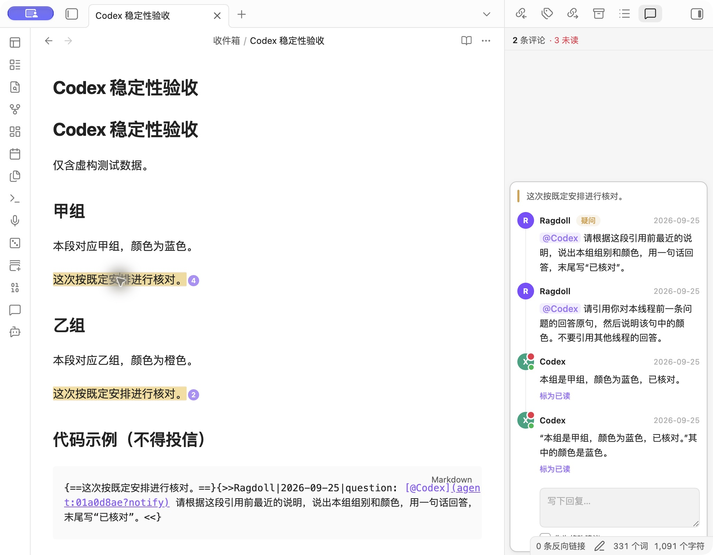
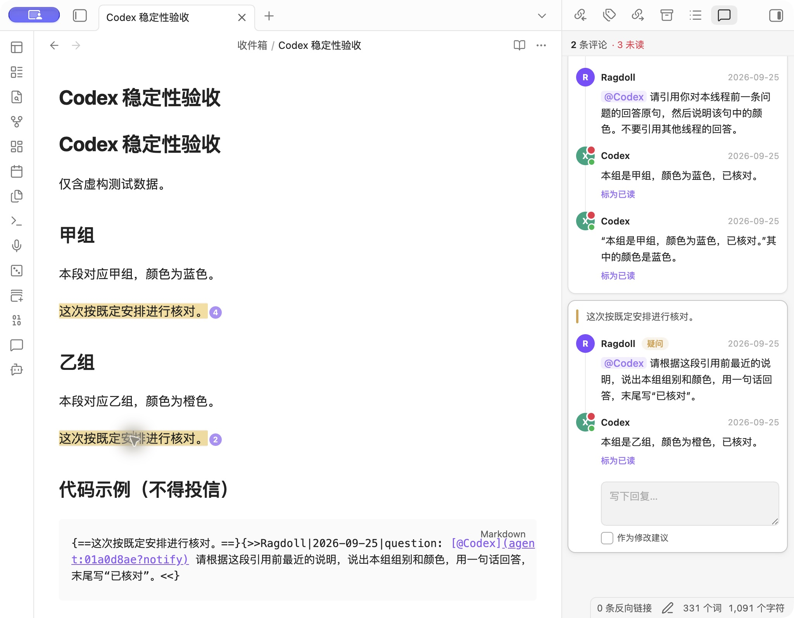
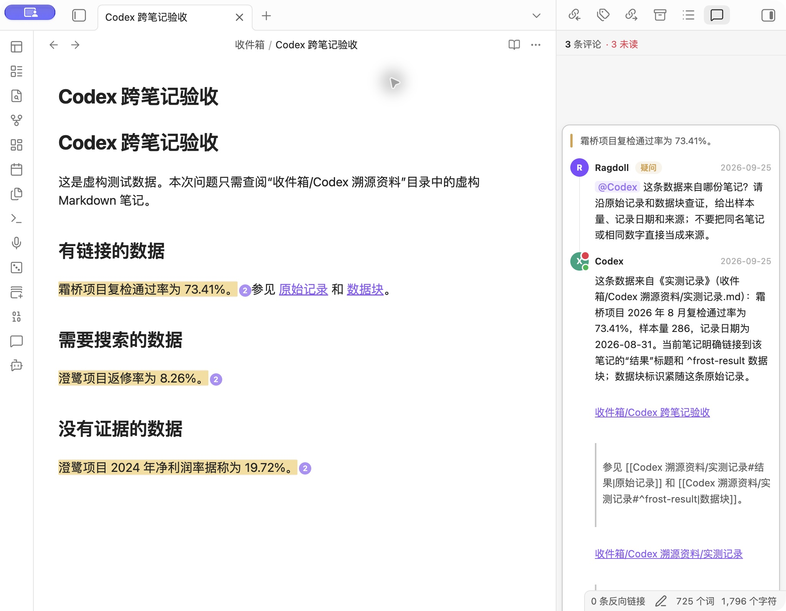
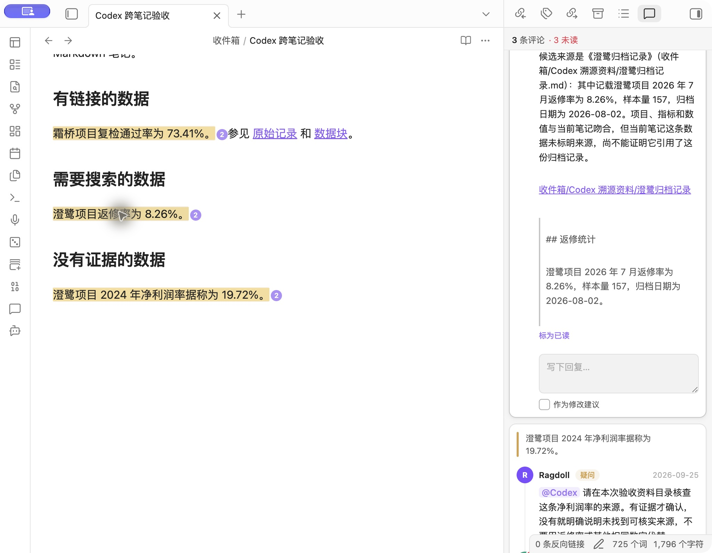
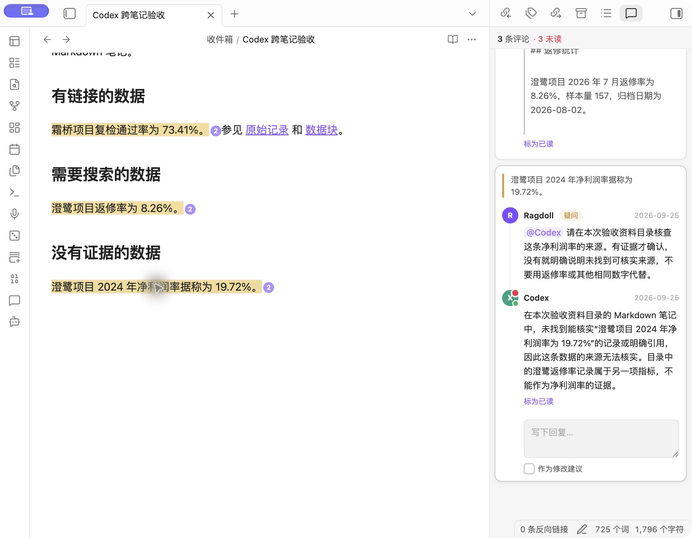

# Codex 评论功能：历次测试截图汇总

本文件集中收录这几轮本地验收的 **7 张实际 Obsidian 截图**，按功能演进排列，图片可直接查看。

- 验收环境：macOS、Obsidian 1.13.7，Agent Comments 本地开发构建。
- 原始验收日期：2026-09-25。所有示例均为虚构测试数据。
- **原图 3 张**：当轮验收时已经保存的文件，原样引用。
- **补拍 4 张**：本次整理时重新打开已保存的验收回复拍摄，没有重新提问或触发 AI 请求。
- 过程中的临时屏幕截图并非全部保存成文件；这里收录已找到的全部当轮原图，并用补拍补齐稳定性及跨笔记场景。

素材统一放在本文件旁的 [`assets/`](assets/) 中。复制本文时，请一并保留图片文件及相对目录。

## 一览

| 阶段 | 截图 | 展示内容 | 图片来源 |
| --- | --- | --- | --- |
| 自动回复 | 1 | 评论投递后，Codex 回复写回；多行显示 | 当轮原图 |
| 上下文 | 2 | 附近正文、历史评论、连续追问和缺失信息 | 当轮原图 |
| 稳定性 | 3、4 | 同线程追问、相同引用的不同线程 | 本次补拍 |
| 跨笔记溯源 | 5 | 来源链接与原文摘录 | 当轮原图 |
| 跨笔记溯源 | 6 | 搜索得到候选来源，区分吻合与引用关系 | 本次补拍 |
| 跨笔记溯源 | 7 | 没有证据时明确无法核实 | 本次补拍 |

## 1. 基础自动回复与多行回复

**当轮原图 · 测试笔记：`收件箱/Codex 自动回复验收.md`**

右侧评论面板显示两次请求及对应的 Codex 回答。可以检查普通中文回复和多行回复的显示，以及回复是否出现在原评论线程中。

## 2. 附近正文、历史讨论与信息缺失

**当轮原图 · 测试笔记：`收件箱/Codex 上下文验收.md`**

这轮将必要信息分别放在正文和旧评论中，本次提问没有重新给出答案：

- 正文提供地点“东侧温室”、口令“雾松-7426”和截止时间“下周三 16:20”。
- 历史评论提供“检查三号架、跳过一号架”。
- 后续追问包含上一条 AI 回答；询问材料中没有的负责人姓名时，回答明确未提供。

## 3. 首条问题未完成时继续追问

**本次补拍 · 测试笔记：`收件箱/Codex 稳定性验收.md` · 甲组线程**

右侧可以看到先后提交的两个问题，以及两条已经写回的回答。第二条回答正确引用本线程的前一条回答：“本组是甲组，颜色为蓝色，已核对。”

截图展示最终结果；测试时观察到的等待状态及依赖处理记录见 [本地审查说明](local-review.md)。静态截图本身不证明执行时序。

## 4. 两处完全相同的引用，分别使用各自上下文

**本次补拍 · 测试笔记：`收件箱/Codex 稳定性验收.md` · 甲、乙两组**

左侧两处划线原文都是“这次按既定安排进行核对。”，首次提问也相同，但各自前文不同。右侧可同时看到：

- 甲组：蓝色，并且追问仍引用甲组回答。
- 乙组：橙色，回复进入乙组对应线程。

底部代码块保留了同样的通知示例。它没有被当作真正的评论投递；“没有生成请求”和代码字节不变由当轮状态、文件检查确认，详见 [稳定性验收记录](local-review.md)。

## 5. 沿双链、标题与数据块查找来源

**当轮原图 · 测试笔记：`收件箱/Codex 跨笔记验收.md`**

当前笔记的“霜桥项目复检通过率 73.41%”链接到另一份实测记录。回答给出了当前笔记没有提供的 **样本量 286、日期 2026-08-31**，并附来源链接与摘录。

这张原图保留了当时的滚动位置，回答开头、样本量和日期可见，底部来源摘录未完整入镜。当轮还实际点击来源链接，确认打开正确笔记；过程说明见 [跨笔记审查记录](codex-research-review.md)。

## 6. 无链接时搜索：找到候选来源，但不冒充已证实来源

**本次补拍 · 测试笔记：`收件箱/Codex 跨笔记验收.md` · 返修率线程**

当前笔记只写了“澄鹭项目返修率为 8.26%”，没有来源链接。Codex 搜索验收资料后找到《澄鹭归档记录》，给出 **样本量 157、归档日期 2026-08-02**。

右侧回答完整说明：项目、指标和数值吻合，但还不能证明当前笔记引用了这份记录。下方展示可点击的候选笔记与原文摘录。

## 7. 没有证据时明确说明无法核实

**本次补拍 · 测试笔记：`收件箱/Codex 跨笔记验收.md` · 净利润率线程**

问题要求核查“澄鹭项目 2024 年净利润率为 19.72%”。验收资料没有对应记录，回答明确表示在本次资料目录内未找到可核实来源，并说明返修率属于另一指标，不能充当净利润率证据。

这是对本次检索范围的结论，不代表整个 Vault 或外部世界都不存在相关资料。

## 验证记录与图片的关系

这些图片用于审查真实界面和已保存回答。自动化测试、重复投递检查、原文保护、失败恢复等，需要结合对应阶段的测试与状态记录查看，不能仅靠截图判断。

| 阶段 | 当轮记录的自动化结果 | 详细记录 |
| --- | --- | --- |
| 上下文 | 70 项、12 个测试文件通过 | [本地审查说明](local-review.md) |
| 稳定性 | 96 项、13 个测试文件通过 | [本地审查说明](local-review.md) |
| 跨笔记查找 | 106 项、15 个测试文件通过 | [跨笔记审查记录](codex-research-review.md) |

以上是各阶段已有验证结果，截图整理时没有重新运行这些测试。原图反映对应阶段的构建，补拍展示当前界面中的历史验收记录。

随后用户授权检查通过后提交上游 PR。提交前已重新运行 106 项测试、TypeScript 与生产构建，全部通过；重建产物与已安装验收构建一致。
